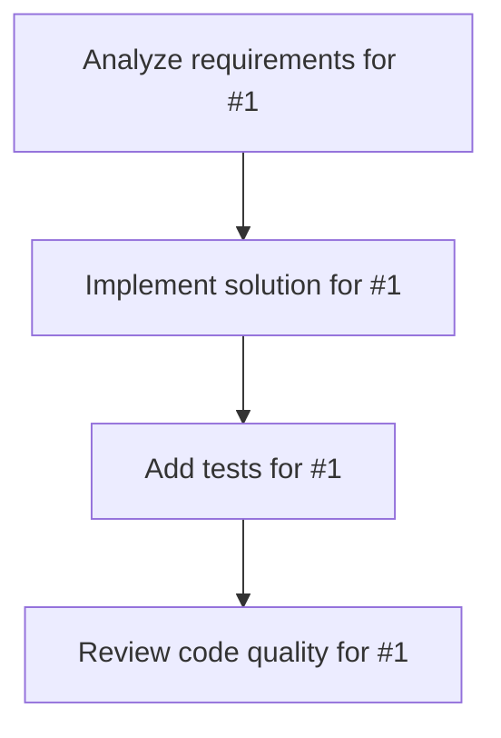

# Plans for Issue #1

**Title**: 予約一覧から予約者を作成・更新・削除できるようにする

**URL**: https://github.com/kazu00132/minpaku-guard/issues/1

---

## 📋 Summary

- **Total Tasks**: 4
- **Estimated Duration**: 60 minutes
- **Execution Levels**: 4
- **Has Cycles**: ✅ No

## 📝 Task Breakdown

### 1. Analyze requirements for #1

- **ID**: `task-1-analysis`
- **Type**: Docs
- **Assigned Agent**: IssueAgent
- **Priority**: 0
- **Estimated Duration**: 5 min

**Description**: Analyze issue requirements and create detailed specification

### 2. Implement solution for #1

- **ID**: `task-1-impl`
- **Type**: Feature
- **Assigned Agent**: CodeGenAgent
- **Priority**: 1
- **Estimated Duration**: 30 min
- **Dependencies**: task-1-analysis

**Description**: ## 🎯 目的

予約一覧画面から直接、予約者の作成・更新・削除ができるようにする。

## 📋 現在の状態

- ✅ 予約一覧の表示はできている
- ❌ 予約の作成・編集・削除機能がない
- ❌ CRUD用のAPIエンドポイントがない

## ✨ 実装内容

### 1. APIエンドポイント追加

POST   /api/bookings          // 予約作成
PUT    /api/bookings/:id      // 予約更新
DELETE /api/bookings/:id      // 予約削除

### 2. フロントエンド機能

- 「新規予約」ボタン追加
- 予約作成モーダル（宿泊者名、予約日時、予約人数、部屋選択、顔写真）
- 予約編集機能（既存予約をクリック）
- 予約削除機能（確認ダイアログ付き）

### 3. バリデーション

- 必須項目チェック
- 予約人数: 1-20人
- 日時: 未来の日付のみ
- 重複予約チェック

### 4. ストレージ更新

server/storage.ts に以下のメソッド追加:
- createBooking
- deleteBooking

## ✅ 完了条件

- [ ] POST /api/bookings実装
- [ ] PUT /api/bookings/:id実装
- [ ] DELETE /api/bookings/:id実装
- [ ] 予約作成UI実装
- [ ] 予約編集UI実装
- [ ] 予約削除UI実装
- [ ] バリデーション実装
- [ ] 動作確認

---

🤖 Generated with [Claude Code](https://claude.com/claude-code)

### 3. Add tests for #1

- **ID**: `task-1-test`
- **Type**: Test
- **Assigned Agent**: CodeGenAgent
- **Priority**: 2
- **Estimated Duration**: 15 min
- **Dependencies**: task-1-impl

**Description**: Create comprehensive test coverage

### 4. Review code quality for #1

- **ID**: `task-1-review`
- **Type**: Refactor
- **Assigned Agent**: ReviewAgent
- **Priority**: 3
- **Estimated Duration**: 10 min
- **Dependencies**: task-1-test

**Description**: Run quality checks and code review

## 🔄 Execution Plan (DAG Levels)

Tasks can be executed in parallel within each level:

### Level 0 (Parallel Execution)

- `task-1-analysis` - Analyze requirements for #1

### Level 1 (Parallel Execution)

- `task-1-impl` - Implement solution for #1

### Level 2 (Parallel Execution)

- `task-1-test` - Add tests for #1

### Level 3 (Parallel Execution)

- `task-1-review` - Review code quality for #1

## 📊 Dependency Graph

## ⏱️ Timeline Estimation

- **Sequential Execution**: 60 minutes (1.0 hours)
- **Parallel Execution (Critical Path)**: 10 minutes (0.2 hours)
- **Estimated Speedup**: 6.0x

---

*Generated by CoordinatorAgent on 2025-10-20 13:13:25 UTC*
